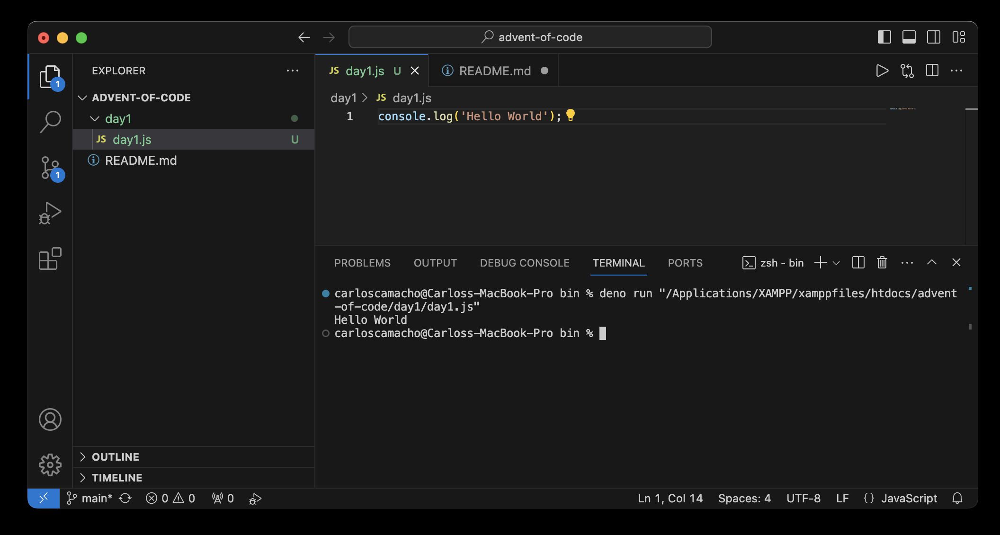
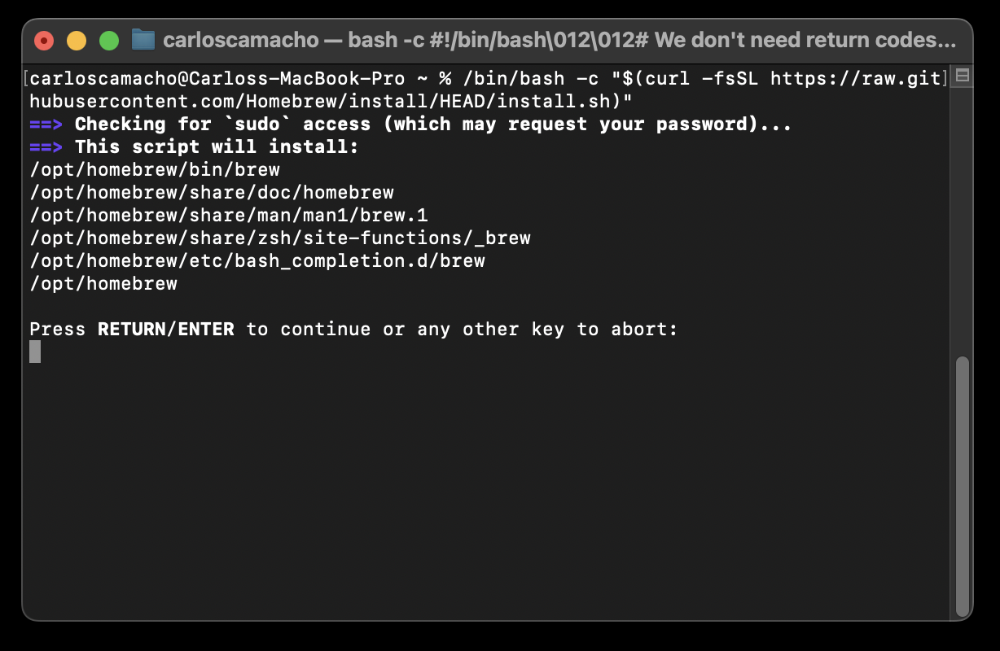

# Advent of Code

I'm using <a href="https://docs.deno.com/runtime/manual/getting_started/installation" target="_blank">deno</a> to run my code. 
<br>It shows the program output in the VSCode terminal.
<br>The sintaxe is as simple as: **deno run** "your file" 

Suppose we have a file named **day1.js** with this line of code:
```javascript
console.log('Hello World');
```
And when we run the program we want to see the output in the VSCode terminal as below:
<br>



## Preparing the setup on a mac

### <a href="https://brew.sh/" target="_blank">Homebrew</a> is a package manager 
1 - First let's install Homebrew using the bash command in the terminal:
```bash
/bin/bash -c "$(curl -fsSL https://raw.githubusercontent.com/Homebrew/install/HEAD/install.sh)"
```
2 - When we see the screen below, press **[ENTER]** to continue




We can see the **brew** installation window.

3 - Click on **Continue** as below:


4 - Once the installation is finished, click on **Close** as below:


5 - To get rid of the installer file, you can click on **Move to Bin** as below:


6 - Let's go to the **brew** directory and then install **deno**. 

Type these commands:

```bash
cd /opt/homebrew/bin 
```
```bash
brew install deno 
```


We can update the PATH variable to include /opt/homebrew/bin 
so that we can run the commands from that directory anywhere. 

If you don't want to do it now, you already can use **deno** inside VSCode. 

1 - Open your VSCode terminal and go to the **deno** directory:

```bash
cd /opt/homebrew/bin 
```

2 - Run your program informing the file path and the file name as the example: 

```bash
deno run "/filepath/day1.js"
```